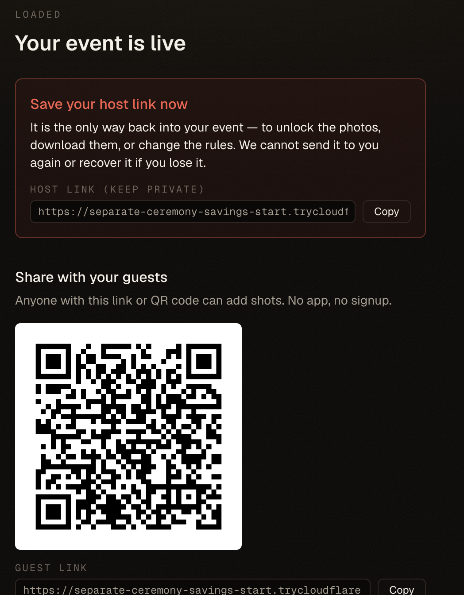
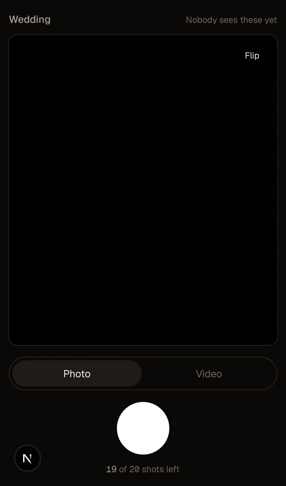
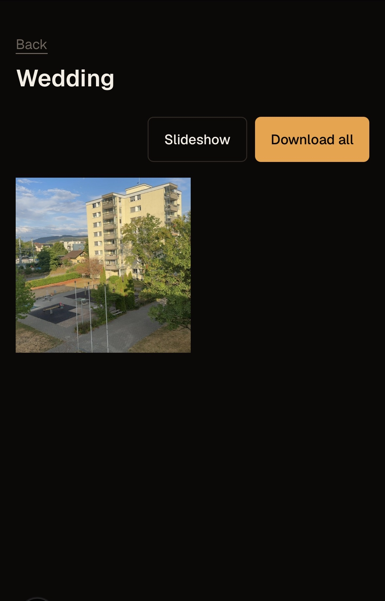

# Shared camera for your event

Everyone shoots. Nobody peeks. You reveal.

A web app for shared event photography — weddings, bachelor parties, birthdays,
group trips, school events. The host creates an event, sets the rules, and
shares one QR code. Guests join in their browser: **no app, no signup**. Each
gets a handful of shots. Nothing is visible to anyone until the host unlocks it,
and only the host collects the roll afterwards — to run as a slideshow at the
party, or to download and share.

<p align="center">
  
  
  
</p>

<p align="center"><em>Screenshots live in <code>docs/screenshots/</code> — drop your own in and they show up here automatically.</em></p>

## How it works

1. **Create an event.** Set how many shots each guest gets and how long it runs.
2. **Share one QR code.** Guests scan it and join in their browser — no app, no signup.
3. **Everyone shoots.** Each guest gets a handful of photos or short videos, and nothing is visible to anyone.
4. **You unlock.** When the party winds down, the host reveals the whole roll.
5. **Slideshow or download.** Play it back on the spot, or download everything as one ZIP.

## Contents

- [How it works](#how-it-works)
- [Why the constraints are the product](#why-the-constraints-are-the-product)
- [Quick start](#quick-start)
- [Status](#status) · [Known limitations & V2 backlog](#known-limitations--v2-backlog)
- [Stack](#stack) · [The look](#the-look) · [Security model](#security-model)
- [Setup](#setup) · [Testing on a real phone](#testing-on-a-real-phone)
- [Licence](#licence)

## Why the constraints are the product

- **Few shots per guest.** Scarcity is the feature. Twenty deliberate photos
  beat two thousand blurry ones.
- **Delayed reveal.** Guests can't scroll a feed mid-party, because there is no
  feed. They shoot and stay present.
- **Private by default.** Guests never get a gallery. The host decides what the
  event looks like when it's over.

## Quick start

```bash
npm install
cp .env.local.example .env.local   # then fill in the values
npm run dev                        # http://localhost:3000
```

**Testing on a phone** needs HTTPS — the camera will not open on a plain LAN
address. One command opens a public tunnel to the running dev server and prints a
scannable **QR code straight to the terminal**:

```bash
npm run tunnel                     # in a second terminal, while `npm run dev` runs
```

Scan the QR with the phone and you are on the app over HTTPS. The tunnel draws a
fresh `*.trycloudflare.com` URL on every start, so the QR saves you reading it
back by hand — no more copying URLs or asking anyone for the link. Create the
event **on that tunnel URL**, not on localhost, or the guest QR encodes localhost
and sends the phone to itself. Full detail and the cloudflared install are under
[Testing on a real phone](#testing-on-a-real-phone).

## Status

All five phases are in. The whole arc works end to end: create an event with
your own limits, share the QR, guests consent and shoot, nothing is visible to
anyone, then you unlock — and the roll is yours to browse, run as a slideshow,
or download as one ZIP. A shot taken where there is no signal waits on the phone
and goes up on its own.

| Phase | Scope | State |
| --- | --- | --- |
| 1 | Schema, tokens, join + consent | Done |
| 2 | Camera capture, upload, EXIF strip | Done |
| 3 | Unlock, host gallery, slideshow, ZIP download | Done |
| 4a | Offline capture queue | Done |
| 4b | Retention cron, deletion warnings | Done |
| 5 | Film-look UI pass | Done |

Three things still need a physical phone before any of this is claimed to work
in someone's hand — see [What no script here can prove](#what-no-script-here-can-prove).

## Known limitations & V2 backlog

This is a **V1 you can run at a real event today**. The happy path — including
the whole video capture, review, and upload flow — is confirmed on a real iPhone
(portrait and landscape, front and back, offline, and airplane-mode-then-signal).
What follows are known edges a code review surfaced, left in deliberately: none
of them break the flow a guest actually walks, and each is a candidate for V2.

**Small guards (a guest could see a broken or blank frame in a rare moment):**

- **Expired preview URL.** On iOS the pre-upload video review plays the clip back
  over a signed HTTPS URL that lasts ten minutes. If a guest leaves the review
  screen open longer than that and the player then needs to re-fetch, it can go
  dead with no fall back to the still frame. Fix: an `onError` on that element
  that drops back to the poster still.
- **Poster capture failure.** The review still is grabbed from the recording
  canvas with `toDataURL`. It is not wrapped in a guard, so on the rare device
  where it throws, the recorded clip is discarded silently instead of shown; and
  if it merely returns empty on iOS before the upload lands, the review can show
  an empty frame with no message. Fix: a `try/catch` around the grab and a
  fallback caption when there is no still.

**Rarer, deeper (correctness under a specific failure, not a visible break):**

- **Double-counted clip on a lost confirm.** If the network drops in the instant
  *after* the server records a kept video but *before* its response arrives, the
  offline queue re-uploads the clip fresh, spending a second of the guest's shots
  and storing a duplicate. This predates the upload-first review; the real fix is
  a keep path that retries the *same* upload rather than queuing a new one.
- **Counter vs. eager reservation.** Recording a video now reserves a server slot
  immediately (so the clip can upload while the guest decides). A pending
  reservation counts against the guest's cap for an hour, but the on-screen "X of
  Y shots left" does not show it — so a guest who retakes many times on a flaky
  connection (where the discard-delete keeps failing) could be told "out of
  shots" while the counter still reads some left. Fix: reflect pending
  reservations in the shown count, or release them more aggressively.

Explicitly *not* on the list: a race in the cancel route where a concurrent keep
and discard could delete a kept clip's bytes — it is unreachable through the UI,
which disables the discard button while a keep is in flight.

## Stack

Next.js 16 (App Router) with Node-runtime route handlers, Supabase Postgres +
Storage, deployed as a single Vercel project. No separate backend service.

## The look

A darkroom: a warm near-black room, warm off-white text, and a single amber
safelight as the only accent. Nothing else is allowed to be colourful, because
the photographs are. Surfaces lift by getting lighter and warmer rather than by
casting a shadow — a drop shadow on near-black is invisible, and every attempt
to make it visible ends in a grey halo that reads as a rendering bug. There is
no light theme: the gallery and the slideshow are the product and both get
looked at in a dim room.

**The grain never touches a photograph.** It lives in `body`'s
`background-image`, not in an overlay, and that is the whole reason: an overlay
covering the viewport covers the photographs too, and the promise is that what
the host sees on screen is what is in the file they download. As a background it
sits behind every descendant by construction — there is no z-index for anyone to
get wrong later. Nothing in the gallery, lightbox or slideshow carries a
`filter`, `mix-blend-mode`, `backdrop-filter` or colour wash. The frame *around*
a photo is pure black rather than the room's warm black, deliberately against
the palette: a warm surround shifts how the eye reads the skin tones inside it.

Its strength is measured rather than chosen. `feTurbulence` with `fractalNoise`
emits noise on all four channels including alpha, so at the 0.4 it started on,
the rect rendered as half-opaque mid-grey and lifted the room to a washed-out
grey-brown with no darkroom left. A `feColorMatrix` kills the colour noise —
which no film stock ever had — and at 0.055 the room measures `#0f0e0d` against
its `#0a0908` token.

One accent means one lit thing per screen. The shutter is the exception and
stays white: it is the control a guest has to find one-handed, in the dark,
without looking, and white on black is the highest contrast a screen can make.
The QR code is the other, for the same kind of reason — it is read by a camera
that needs real contrast, and tinting it to suit the room produces a poster
nobody can scan across a dim venue.

## Security model

The browser never talks to Supabase. Every table runs RLS with **no policies**
for `anon`/`authenticated`, and privileges are revoked on top — so the anon key
is denied at two independent layers. All access goes through route handlers
holding the `service_role` key, which makes the handler itself the access check.
`scripts/verify-rls.mjs` proves this against the live database rather than
asserting it.

Guest and host tokens are drawn independently from the CSPRNG (128-bit and
256-bit). The guest link goes to the whole party; the host link is the only
thing guarding unlock and delete, so leaking one must reveal nothing about the
other. A guest's session is a signed cookie carrying a role and an event id, so
it cannot be replayed at another event.

There is no host cookie, deliberately. The host token in the URL is the
credential, re-checked against the database on every host request. A cookie
could not add a second factor — every host request already carries the token,
so anyone who can send one could mint the cookie too — while it *would* add a
CSRF surface, because a cookie-authenticated POST can be forged by any page the
host visits and a URL-borne credential cannot. It would also outlive its tab: a
30-day cookie left on the party laptop is a worse leak than the URL it replaced.
Phase 1's unused `setHostSession`/`readHostSession` were removed in Phase 3 for
the same reason — dead auth helpers get wired up by someone who assumes they
gate something.

The reveal is one gate in one place (`isEventUnlocked` in `lib/events.ts`,
reached through `gateHostMedia`). Gallery, slideshow and download-all all ask
it, and the plan's separate `/slideshow` route was deliberately not built: two
routes are two places to remember the check, and the one that gets forgotten is
the one that serves the whole party's photos.

That single home is also why the gallery's "Slideshow" and "Download all" live
inside `GalleryGrid` rather than in the page around it. The page deliberately
does not know whether the roll is open — only the route does, and the grid is
what it answers. While those buttons sat in the page header they rendered over a
sealed event too, so a host arriving at the gallery URL directly was offered a
lit "Download all" that answered 403 with a raw JSON body in their browser
window. Nothing was exposed — the server refused, as it is supposed to — but the
interface was lying, and the fix is to let the component that already knows do
the deciding rather than to teach the page the rule a second time. The host is gated by their own
unlock even though they can lift it in one tap — that tap stamps `unlocked_at`
and starts the retention clock, so the reveal cannot happen quietly. That stamp
is written exactly once: every unlock write carries "and the event is still
locked" in its WHERE clause, so racing requests cannot move the deletion date.

Media lives in a private bucket. The browser gets a short-lived signed URL for
the one object it is uploading and nothing else — the bytes go straight to
Storage because a 15s clip is far larger than a route handler will accept, but
the server bookends it: `upload/init` decides whether the guest may shoot at
all, and `upload/confirm` strips the photo's metadata and moves the quota
counters. Nothing counts until confirm succeeds, so an abandoned upload leaves
an invisible `pending` row, which the nightly sweep clears once it is an hour
old. An hour is when it *becomes* sweepable, not when it goes: the sweep runs at
03:00, so such an object can sit in the bucket for the better part of a day.
That matters more than its size suggests — `confirm` never ran on it, so its
EXIF was never stripped. It is unreachable by anyone in the meantime, since
nothing but a signed URL can read the bucket and none is ever minted for it.

A shot that finds no network is written to IndexedDB rather than lost. The
places people take the best photos — a cellar bar, a stone church, a marquee in
a field — are the places with no bars, and a guest with twenty shots cannot be
asked to check their signal before each one. What is stored is the capture, not
the reservation: a signed upload URL expires in 60 seconds, so persisting one
would persist rubbish. The queue then goes up on the `online` event, when the
tab is looked at again, on the next page load, or when the guest taps the
button — four triggers because no single one of them is honest on a phone
drifting between saturated venue wifi and 4G.

Sending a queued shot twice would spend two of the guest's allowance on one
photo, so two things stop it. A flusher claims an item inside a single
IndexedDB transaction, which serialises two tabs racing each other; and the
queue records the mediaId only once the bytes are provably in the bucket, so a
resumed upload knows whether to start over from init (nothing was spent, the
orphan is swept within the day) or to retry confirm alone (which the server
answers idempotently). The one case left is a flush killed mid-upload and
reclaimed after its five-minute lease while the original is somehow still
running — narrower than the soft quota cap below, and bounded by the same
server-side counters.

Quotas are enforced by the database, not by the route. Each counter moves in a
single statement that carries its own limit (`update … where upload_count <
max_uploads_per_guest`), so a check cannot go stale between reading and
writing — twenty guests hitting Keep at the same second cannot all claim the
last slot.

Deleting an event erases the bytes first and marks the rows second, so a crash
in between leaves the media gone rather than an event marked deleted with the
photos still sitting there. The purge works from the bucket listing, not from
`media_items` rows: an abandoned upload leaves an object whose row never
reached `confirmed`, which means `confirm` never ran and its metadata was never
stripped. A row-driven delete would walk straight past exactly that file.

The deletion the consent notice promises is carried out by one nightly cron
(`0 3 * * *`), and it is the only thing that makes that promise true rather than
decorative. It does not decide the date: it reads `retentionDeadline()` and
`unlockMoment()` — the same two functions the host's countdown is drawn from —
because a sweep with its own opinion of the date would delete media on a day the
host was never shown. The clock starts at the reveal, not at creation, so an
event made in January and unlocked in June keeps its media until June plus
`retention_days`; an event never unlocked has no deadline and never expires.
`CRON_SECRET` is the whole gate, compared in constant time, and the route
refuses to run at all when it is unset — a deploy that forgets it stops deleting
rather than starts deleting for anyone who finds the URL.

`scripts/verify-exif.mjs` proves metadata stripping against raw JPEG segment
bytes rather than asking the imaging library to grade its own work.
`scripts/verify-upload.mjs` drives the real guest routes and reads each stored
object back through a signed URL — the same path the host reads — to prove what
actually landed in the bucket. `scripts/verify-host.mjs` drives the real host
routes: 95 checks covering the pre-unlock 403 on a direct call, guest tokens
against every host route, `unlocked_at` surviving a replay and a three-way
race, the ZIP's own bytes, and the abandoned object really leaving Storage on
delete. `scripts/verify-retention.mjs` runs the real cron route against
backdated events: every deletion it checks is paired with a survival check,
because a sweep that deleted every event on earth would pass a test that only
looks at the one it was supposed to take.

There is no service worker, so a queued shot goes up while the tab is alive or
when it is opened again — not while the browser is closed. Background Sync
would cover that last case on Chrome and never on iOS, and it cannot reuse the
upload path: service workers have no `XMLHttpRequest`, which is what the upload
uses to report progress. It would therefore mean a second, hand-written copy of
the code that spends guests' quota, drifting out of step with the first. The
four page-driven triggers cover every browser instead of adding a fifth that
covers one.

There is no web app manifest either. Its only job would be Add to Home Screen,
and the promise on the tin is that a guest scans a QR and shoots — nobody
installs an app for one evening.

Known and accepted for the MVP: a guest can clear storage or switch devices to
get a fresh quota. Without accounts this is a soft cap backed by a host-visible
count, not a cryptographic guarantee. Video metadata is **not** stripped —
that needs a demuxer we do not ship, the consent notice says so plainly, and it
is a Phase 4 gap. Rate limiting and bot protection are deliberately deferred.

The host link is the whole credential, and the slideshow puts it on a screen in
front of a room. Fullscreen hides the URL bar, but a photograph of the address
bar is a full compromise — inherent to account-less URL tokens, which is why
the create screen says the link is unrecoverable and private.

`download-all` is bounded by wall-clock, not memory: it streams one object at a
time, but Vercel's Hobby plan cuts a function off at 60s, so a large event over
a slow connection will break off mid-file. The gallery's per-item downloads are
the honest fallback; fixing it properly needs a paid plan or a pre-built
archive in Storage.

## Setup

```bash
npm install
cp .env.local.example .env.local   # then fill in the values
npm run dev
```

Apply `supabase/migrations/0001_init_schema.sql` to a Supabase project, then
verify the database actually denies the anon key:

```bash
node --env-file=.env.local scripts/verify-rls.mjs
```

Every check must print `42501: permission denied`. Anything else means RLS is
not holding.

Then prove metadata stripping, and the guest and host paths end to end (the
latter two need `npm run dev` running):

```bash
node --conditions=react-server --experimental-strip-types scripts/verify-exif.mjs
node --env-file=.env.local scripts/verify-upload.mjs
node --env-file=.env.local scripts/verify-host.mjs
node --env-file=.env.local scripts/verify-retention.mjs
```

Each must exit 0. They create their own events and delete them afterwards.
`verify-retention.mjs` additionally needs `CRON_SECRET` set to the same value the
dev server was started with — it calls the cron route the way Vercel does.

### Testing on a real phone

The camera needs HTTPS, and that one fact decides the whole setup. Browsers
expose `getUserMedia` only in a secure context, and `localhost` is the single
insecure origin they make an exception for — an exception that does **not**
extend to the LAN address a phone would need to reach the machine. Serving the
dev server at `http://192.168.x.x:3000` therefore fails in the worst way
available: the page loads, the layout is right, and `navigator.mediaDevices` is
simply absent. It reads as a bug in the capture code, and it is not one.

A tunnel supplies a real certificate and sidesteps all of it. `npm run tunnel`
([`scripts/tunnel.mjs`](scripts/tunnel.mjs)) wraps `cloudflared`, reads the fresh
URL out of its output, and renders it as a QR code in the terminal so a phone can
join without anyone reading the URL back:

```bash
npm run tunnel                     # while `npm run dev` is running
```

The raw command it wraps, if you want it by hand:

```bash
cloudflared tunnel --url http://localhost:3000
```

`brew install cloudflared` may decide to build Go from source first, which takes
longer than the thing you were trying to test. The release binary is a download:

```bash
# amd64 for Intel, arm64 for Apple Silicon — check with `uname -m`
curl -fsSL -o cloudflared.tgz \
  https://github.com/cloudflare/cloudflared/releases/latest/download/cloudflared-darwin-amd64.tgz
tar xzf cloudflared.tgz && mv cloudflared /usr/local/bin/
```

Open the printed `https://….trycloudflare.com` **on the desktop** and create the
event there. The QR is built from `window.location.origin`, so an event created
at localhost encodes localhost and sends the guest's phone to the guest's own
phone. This is also why `NEXT_PUBLIC_APP_URL` is left unset locally: a quick
tunnel draws a fresh URL on every restart, and pinning one in `.env.local` means
editing it each time.

`next.config.ts` carries `*.trycloudflare.com` in `allowedDevOrigins`. Next
blocks cross-origin requests to dev-only assets by default, so without that entry
the tunnel serves a page that cannot load its own scripts.

A quick tunnel is unauthenticated and world-reachable for as long as it runs,
in front of a real Supabase project. The URL is unguessable and that is the only
thing guarding it. `pkill cloudflared` when done.

### Capture: orientation, mirror, and video format

A phone camera lies about which way is up, and two of those lies had to be
undone in the capture code so the host's roll comes out straight.

**Upright, even with rotation lock on.** A shot taken sideways should be saved
portrait, not on its side. `screen.orientation` knows the angle — but a phone
with its rotation lock on reports portrait forever and never sees the sideways
grip, which is the common case. So capture also listens to the motion sensor
(`devicemotion`), which reads gravity directly and is the only signal that
survives the lock; once it has spoken it wins over the screen. iOS hands out that
sensor only after a permission prompt fired from a user gesture, so the first
shutter or record tap requests it. The frame is then rotated upright on a canvas
before it is kept. The one thing a phone can never tell us is direction under
lock, so the landscape-left / landscape-right mapping is a fixed pair of
constants in `CameraCapture.tsx` — flip them if a device turns out to spin the
wrong way.

**Un-mirrored front camera.** The preview is mirrored because that is what a
mirror does, but iOS hands us the front frame already mirrored, so a plain draw
bakes back-to-front text into the kept shot. Photos flip it back on the canvas.

**Video gets the same treatment by recording through a canvas.** `MediaRecorder`
on the raw camera track would keep both the mirror and the sideways grip, because
it never sees the canvas the photo path uses. So a clip is drawn frame by frame
through a canvas carrying the same rotate-and-flip transform, and
`canvas.captureStream()` — plus the microphone track — is what actually gets
recorded. Orientation is frozen at the start of the clip.

**Format is whatever the phone records, converted on the way out.** Safari
records `.mp4`, Chrome/Firefox record `.webm`, and the bytes are stored as-is —
the slideshow and gallery play both without complaint, so nothing is transcoded
server-side (that would need an ffmpeg pipeline the free tier cannot run). For a
host who wants `.mp4` everywhere, [`scripts/webm-to-mp4.sh`](scripts/webm-to-mp4.sh)
batch-converts a downloaded folder locally with ffmpeg — renaming does **not**
work, the bytes must be re-encoded. The app is untouched by it.

The preview autoplays the clip muted before the guest keeps it — iOS refuses
autoplay with sound, and React does not apply the `muted` attribute reliably, so
`CapturePreview` sets `muted` as a property and calls `play()` itself.

### What no script here can prove

The offline queue has no verification script, because the thing worth proving
about it only exists in a browser: IndexedDB, `XMLHttpRequest`, the `online`
event, a real camera. A Node harness for it would be four shims deep and would
mostly test the shims. It was verified instead by driving the real capture
screen in Chrome with the network cut at the CDP level — capture offline, watch
the server stay empty, reconnect, watch the shot arrive confirmed and stripped
and counted exactly once.

The look has no script either, for the same reason, but the two claims worth
holding it to were measured in the browser rather than eyeballed. That the room
is really Geist and not the fallback: the same string measures 663.11px under
the body stack and under Geist, and 656.47px under Arial — `getComputedStyle`
reports what the CSS asks for, not what rendered, and it said "Geist" the whole
time the app was actually drawing Arial. That the grain cannot reach a
photograph: of 432 CSS rules, the only three mentioning it all target `body` and
all carry it as a background property; no viewport-sized element and no `body`
pseudo-element exists; and a rendered gallery photo reports `filter: none`,
`mix-blend-mode: normal`, `backdrop-filter: none`, `opacity: 1`.

A viewfinder with no camera behind it proves nothing about layout, and this cost
a release. A headless browser hands `<video>` no stream, so the element has no
intrinsic size — and a flex item with nothing to measure cannot overflow. The
capture screen therefore measured perfectly at phone dimensions in Chrome while
the shutter sat 320px below the fold on an actual phone, behind a scroll, which
is the one control a guest has to find without looking. What reproduced it was
feeding the element a 720×1280 canvas stream: 996px of content in a 632px
viewport, against 632/632 once `min-h-0` let `flex-1` shrink and `h-dvh`
replaced `min-h-dvh`. Anything touching that screen has to be measured with a
stream attached, or it is measuring an empty box.

Three things still need a real device and are not claimed to work until someone
checks them:

- **iOS Safari.** It is the phone half the guests will be holding and the only
  engine whose IndexedDB and background-tab behaviour we are trusting on
  reputation. Capture in airplane mode, lock the phone, come back, reconnect.
- **Real video sizes.** `videoBitsPerSecond` is a hint, not a contract. The
  ~5 MB estimate the 15s cap rests on has never met an actual phone.
- **Video through the queue.** Only photos have made the offline round trip; a
  40 MB clip is the same code path with a much longer PUT.

### If the app renders in Arial

It did, from Phase 1 until Phase 5. `create-next-app` leaves
`body { font-family: Arial, Helvetica, sans-serif }` in `globals.css`, which
silently overrides the Geist that `next/font` loads and that `@theme` maps into
`--font-sans`. Both fonts were fetched on every visit and neither was ever
shown, and nothing failed — no error, no warning, and `getComputedStyle` cannot
see it. The Arial that remains in the built CSS is `next/font`'s own
metric-adjusted fallback (`@font-face { font-family: Geist Fallback; src:
local(Arial) }`) and belongs there.

### If a hydration error fires on a phone but never on the desktop

Chrome on iOS stamps `__gcrremoteframetoken` onto `<html>` through its `__gCrWeb`
bridge before React runs, and React dutifully reports the attribute it did not
render as a server/client mismatch. The attribute is the browser's, not ours,
and there is nothing to reconcile — which is what `suppressHydrationWarning` on
`<html>` in `app/layout.tsx` is for. It reaches exactly one level, so real
mismatches inside the app still report.

Two things about this are worth keeping. Next's overlay names a browser extension
as a possible cause, and that line deserves to be read literally rather than
dismissed: here it was the browser itself, on a phone with no extensions. And the
dev server forwards browser console errors to the terminal, so the same error
appearing there is not evidence the server produced it — which is exactly the
wrong turn this took the first time.

### If routes 404 in dev that exist on disk

`next build` and `next dev` share the `.next` directory and do not agree about
what belongs in it. Running the production build and then starting the dev
server leaves a state where some routes resolve and others return Next's own 404
page — nested ones go first, so `/api/host/[hostToken]` keeps working while
`/api/host/[hostToken]/unlock` disappears, which reads exactly like a bug in the
route you just wrote. `rm -rf .next` and restart. Worth knowing before you spend
an hour debugging code that was never broken.

### If `fetch` fails with "unable to get local issuer certificate"

Node ships its own CA list rather than using the system keychain, so a machine
that inspects TLS will break `fetch` — and therefore `supabase-js` — while curl
keeps working. Point Node at the same bundle npm already uses:

```bash
export NODE_EXTRA_CA_CERTS="$HOME/.config/npm-certs.pem"
```

## Licence

Not yet chosen.
